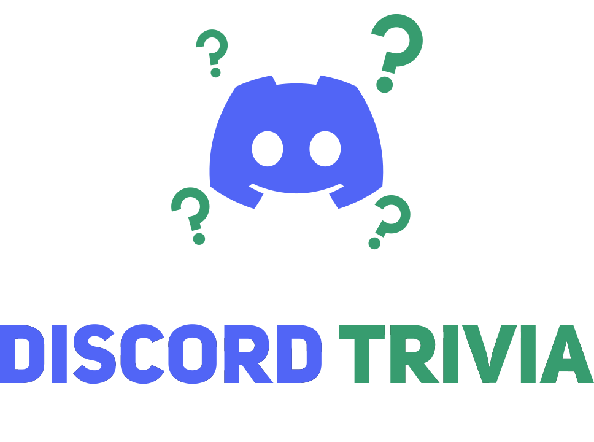



# Discord Trivia
discord-trivia is a NodeJS library which builds on top of [open-trivia-db](https://github.com/Elitezen/open-trivia-db-wrapper) and [Discord.JS](https://github.com/discordjs/discord.js/) to easily integrate trivia matches with your Discord client.

Guide: https://dev.to/elitezen/code-fully-fledged-trivia-games-in-discordjs-ge8

Website: https://elitezen.github.io/discord-trivia-website/

## 1.0.3
- Removed Uneeded Packages

## Installation
Requires Node v16+ and Discord.JS 13.7.0 or higher
```
npm i discord-trivia
```

## Example Usage
Adjust to your command handler as necessary.

### **/** Using Slash Commands
```js
import { TriviaCommandBuilder, TriviaManager } from 'discord-trivia';

const cmd = new TriviaCommandBuilder();

const trivia = new TriviaManager({
  theme: 'RED'
});

module.exports = {
	data: cmd.toBuilder(),
	async execute(interaction) {
	  const game = trivia.createGame(interaction, cmd.getOptions(interaction));

      game
        .start()
        .catch(console.error);
	},
};
```

### 💬 Using Messages
```js
import { TriviaManager } from 'discord-trivia';

const trivia = new TriviaManager();

client.on('messageCreate', message => {
  if (message.author.bot) return;

  const game = trivia.createGame(message);
  
  game
    .start()
    .catch(console.error);
});
```

# ✨ Customizable
Discord Trivia Gives you the power to customize your matches as you wish.

### Questions
Discord Trivia games are powered by [open-trivia-db](https://github.com/Elitezen/open-trivia-db-wrapper), which is a wrapper for the [Open Trivia Database](https://opentdb.com/) API. You can declare the exact type of questions you wish to be part of a match via [TriviaGameOptions](#triviagameoptions)

```js
const game = trivia.createGame(interaction, {
    timePerQuestion: 15_000,
    questionData: {
      category: 'history',
      amount: 10,
      difficulty: 'hard',
      type: 'multiple'
    }
});
```

**Tip**: Install open-trivia-db to your project to recieve tools for OpenTDB, including intellisense on longer OpenTDB category names.

```
npm i open-trivia-db
```

```js
import { CategoryNamesStrict } from "open-trivia-db";

const game = trivia.createGame(interaction, {
    questionData: {
      category: CategoryNamesStrict.ENTERTAINMENT_MUSICALS_AND_THEATRES
    }
});
```

🚨 **Keep in mind**: open-trivia-db only works with ESM import/export syntax.

## ⭐ Custom Questions
Create your own questions and have Discord Trivia serve them.

Your question objects must be in the shape of [CustomQuestion](#customquestion) and be parsed by `prepareCustomQuestions()`

```js
const myQuestions = [
  {
    value: 'Best Ice Cream Flavor?',
    correctAnswer: 'Shrimp',
    incorrectAnswers: ['Vanilla', 'Chocolate', 'Strawberry']
  }
];

const game = trivia.createGame(interaction, {
  questionData: myQuestions
});
```

### 🛠️ Game Configuration
Customize lobby restrictions, how your fast game flows and handles awarding points.

```js
const game = trivia.createGame(interaction, {
    minimumPlayerCount: 5,
    maximumPlayerCount: 20,

    queueTime: 20_000,
    timePerQuestion: 15_000,
    timeBetweenRounds: 10_000,

    minimumPoints: 10,
    maximumPoints: 100,
    pointsPerStreakAmount: 20,
    maximumStreakBonus: 100,
    streakDefinitionLevel: 3
});
```

### Theme
Edit the color of the embeds via [TriviaManagerOptions](documentation#interfaces-triviamanageroptions)

```js
const redTrivia = new TriviaManager({
  theme: 'RED'
});

const blueTrivia = new TriviaManager({
  theme: '#0000FF'
});

const randomColorTrivia = new TriviaManager({
  theme: 'RANDOM'
});
```

### Embed Image
Edit the default embed image.

```js
const trivia = new TriviaManager({
  image: 'https://nerdist.com/wp-content/uploads/2020/07/maxresdefault.jpg'
});
```

### 🔔 Events
Execute code when something happens in your match or the state of your match changes.

```js
game.on('pending', () => {
    // Code
});

game.on('queue', () => {
    // Code
});

game.on('playerJoinQueue', player => {
    // Code
});

game.on('inProgress', () => {
    // Code
});

game.on('ended', data => {
    // Code
}); 

await game.start();
```

🚨 **Keep in mind**: Your listeners must be assigned **before** starting a game, otherwise they may not be registered in time.

# Documentation (Draft)

## Interfaces

## CustomQuestion
A custom made question

```ts
interface CustomQuestion {
  value: string;
  category?: CategoryName<"Strict">;
  difficulty?: QuestionDifficulty;
  correctAnswer: string;
  incorrectAnswers: [string, string, string] | [`${boolean}`];
}
```

## `TriviaGameData`
The data a game holds.

Includes: [GuildMember](https://discord.js.org/#/docs/main/stable/class/GuildMember), [Collection](https://discord.js.org/#/docs/collection/main/class/Collection), [Snowflake](https://discord.com/developers/docs/reference#snowflakes), [TriviaPlayer](#triviaplayer)
```ts
interface TriviaGameData {
  hostMember: GuildMember;
  players: Collection<Snowflake, TriviaPlayer>;
}
```

## `ResultPlayerData`
An entry of player data once the match ends.

Includes: [Snowflake](https://discord.com/developers/docs/reference#snowflakes)
```ts
interface ResultPlayerData {
  id: Snowflake;
  points: number;
}
```

## `TriviaGameResultData`
The data of a game once the match ends.

Includes: [Snowflake](https://discord.com/developers/docs/reference#snowflakes), [ResultPlayerData](#resultplayerdata)
```ts
interface TriviaGameResultData {
  hostMemberId: Snowflake;
  players: ResultPlayerData[];
}
```

## `TriviaGameOptions`
The configuration for a game.

Includes: [Question](https://github.com/Elitezen/open-trivia-db-wrapper/wiki/Documentation#question)
```ts
interface TriviaGameOptions {
  questionData: QuestionData | Question[];
  minimumPlayerCount: number;
  maximumPlayerCount: number;
  timePerQuestion: number;
  queueTime: number;
  minimumPoints: number;
  maximumPoints: number;
  pointsPerStreakAmount: number;
  maximumStreakBonus: number;
  streakDefinitionLevel: number;
  timeBetweenRounds: number;
}
```

### `TriviaManagerOptions`
A manager's configuration

Includes: [ColorResolvable](https://discord.js.org/#/docs/main/stable/typedef/ColorResolvable)

*theme: The color to set for embeds.*
```ts
interface TriviaManagerOptions {
  theme?: ColorResolvable;
  showAnswers?: boolean;
}
```

## `TriviaPlayer`
A player of a game

Extends: [GuildMember](https://discord.js.org/#/docs/main/stable/class/GuildMember)
```ts
interface TriviaPlayer extends GuildMember {
  points: number;
  hasAnswered: boolean;
  isCorrect: boolean;
  correctAnswerStreak: number;
}
```

## `QuestionData`
Metadata for target questions to fetch.

Includes: [CategoryResolvable](https://github.com/Elitezen/open-trivia-db-wrapper/wiki/Documentation#CategoryResolvable), [QuestionDifficulty](https://github.com/Elitezen/open-trivia-db-wrapper/wiki/Documentation#QuestionDifficulty), [QuestionType](https://github.com/Elitezen/open-trivia-db-wrapper/wiki/Documentation#questiontype)

```ts
interface QuestionData {
  category: CategoryResolvable | null;
  amount: number;
  difficulty: QuestionDifficulty | null;
  type: QuestionType | null;
}
```

# Bug Reporting
[View the bug report template](https://github.com/Elitezen/discord-trivia/blob/main/.github/ISSUE_TEMPLATE/bug-report.md)

# Contributing
[Read here for contributing](https://github.com/Elitezen/discord-trivia/blob/main/CONTRIBUTING.md)

# Support Server
Click to join:

[](https://discord.gg/wtwM4HhbAr)