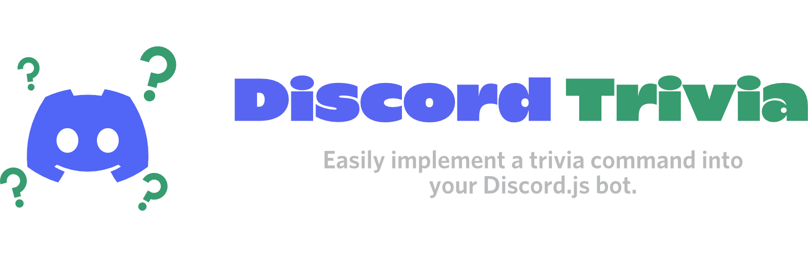

# Discord Trivia


A package that provides an easy way to create fully-fledged trivia games for Discord bots with [Discord.JS](https://discord.js.org/#/). Includes support for +20 categories as well as customizable game settings, themes, and game messages. Comes with a built-in leaderboard system to track scores and rankings.


## 2.0.3

- Fixed bug causing error message "Invalid Root!"
- Compilation now targets ES2020


---


**Discord.js v14**


```bash
npm install discord-trivia
```


**Discord.js v13** (Deprecated)


Visit [here](https://github.com/Elitezen/discord-trivia/tree/aeed2957b0a8adb9488ba7f3eb6a2ac17d83ab8a) for a guide in v13.


```bash
npm install discord-trivia@1.1.0
```


[**Join the support server for help, bug reports, or feature requests.**](https://discord.gg/wtwM4HhbAr)


---


## Example Code for Slash Commands


```js
const { SlashCommandBuilder, Colors, ButtonStyle } = require("discord.js");
const { TriviaManager } = require("discord-trivia");

const trivia = new TriviaManager();

module.exports = {
  data: new SlashCommandBuilder()
    .setName('trivia')
    .setDescription('Test out trivia'),
  async execute(interaction) {
    const game = trivia.createGame(interaction)
      .decorate({
        embedColor: Colors.Green,
        buttonStyle: ButtonStyle.Primary
      })
      .setQuestionOptions({
        amount: 15,
        category: 'Animals',
        difficulty: 'hard',
      })
      .setGameOptions({
        showAnswers: true,
        timePerQuestion: 15_000,
        maxPoints: 100
      });


    game.setup()
      .catch(console.error);
  }
}
```


## Example for Messages


```js
client.on('messageCreate', message => {
  if (message.author.bot) return;

  const game = trivia.createGame(message)
    .decorate({
      embedColor: Colors.Green,
      buttonStyle: ButtonStyle.Primary
    })
    .setQuestionOptions({
      amount: 15,
      category: 'Animals',
      difficulty: 'hard',
    })
    .setGameOptions({
      showAnswers: true,
      timePerQuestion: 15_000,
      maxPoints: 100
    });

  game.setup()
    .catch(console.error);
});
```


## Usage


Discord Trivia is highly customizable. Change the color of your embeds, styles of the buttons, and game settings.


### Decorate Your Game and Make it Feel Unique!


```js
game.decorate({
    embedColor: Colors.Purple,
    buttonStyle: ButtonStyle.Danger,
    embedImage: 'https://link-to-cool-background/',
    embedThumbnail: 'https://link-to-epic-icon/'
  })
```


### Create Your Own Questions For The Game!


```js
import { CategoryNames, CustomQuestionBuilder, QuestionDifficulties } from "discord-trivia";

const myQuestions = [
  new CustomQuestionBuilder.Boolean()
    .setValue("discord-trivia is awesome!")
    .setCategory("My epic category")
    .setDifficulty('easy')
    .setCorrectAnswer('true'),
  new CustomQuestionBuilder.Multiple()
    .setValue("What's the best pizza topping?")
    .setCategory(CategoryNames["General Knowledge"])
    .setDifficulty(QuestionDifficulties.Medium)
    .setCorrectAnswer("Chicken feet")
    .setIncorrectAnswers(["Pepperoni", "Sausage", "Olives"])
  // ...
];

game.setCustomQuestions(myQuestions);
```


### Customize The Library's Outputs


```js
game.setGameTexts({
  alreadyQueued: (user) => `❗ You are already in the queue, ${user.username}`,
  preparingQuestion: () => "🕥 Preparing the next question...",
  notInMatch: () => "❌ You are not apart of this match",
  alreadyChoseAnswer: (user) => `You already chose an answer ${user.username}!`,
  gameFailedRequirements: () => "Game failed to meet minimum player requirements",
  answerLockedInPrivate: (user, timeElapsed) => `You locked in at ${timeElapsed / 1000} seconds`,
  memberJoinedGamePrivate: () => "You joined the game!"
});
```


### Control Your Game With Extensive Configuration.


```js
game.setGameOptions({
    queueTime: 30_000,
    minPlayerCount: 3,
    maxPlayerCount: 20,
    minPoints: 10,
    maxPoints: 100,
    timeBetweenRounds: 5_000,
    timePerQuestion: 15_000,
    streakDefinitionLevel: 3,
    pointsPerSteakAmount: 30,
    maximumStreakBonus: 300,
    showAnswers: true
  });
```


### Choose The Best Questions for You and Your Friends.


```js
game.setQuestionOptions({
    amount: 15,
    category: 'History',
    difficulty:'medium',
    type: 'multiple'
  });
```


### Listen for Game Events.


Make sure to assign event listeners *before* calling `game.setup()`


```js
game.on('pending', () => { ... });
game.on('queue', () => { ... });
game.on('memberJoin', member => { ... });
game.on('end', finalData => { ... });

game.setup()
  .catch(console.error);
```


This module's questions are supplied using `open-trivia-db`, an API wrapper for [OpenTDB](https://opentdb.com/). Visit the [NPM page](https://www.npmjs.com/package/open-trivia-db) to learn more.